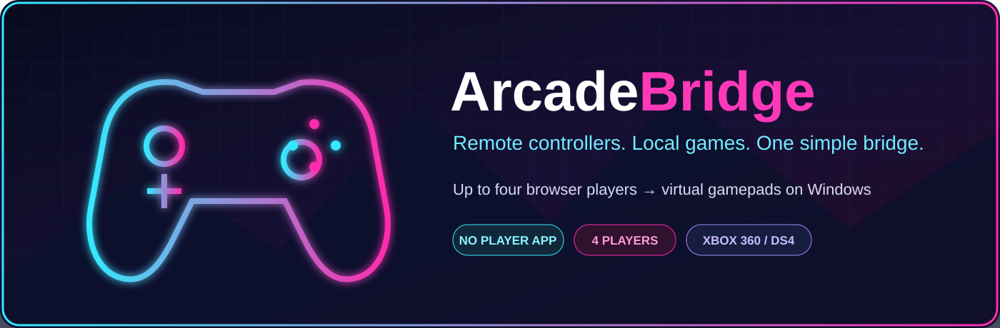
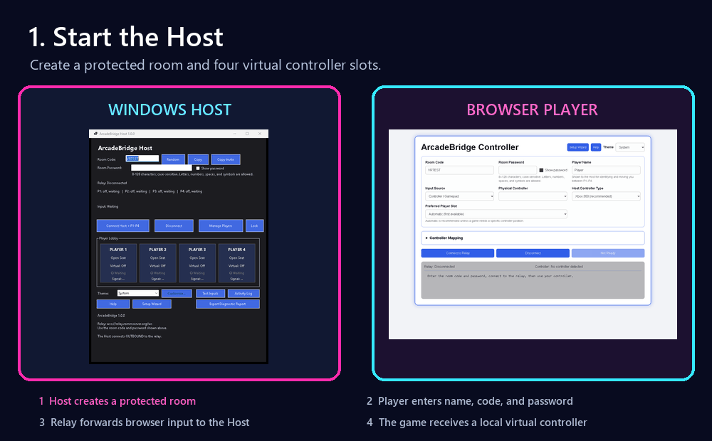
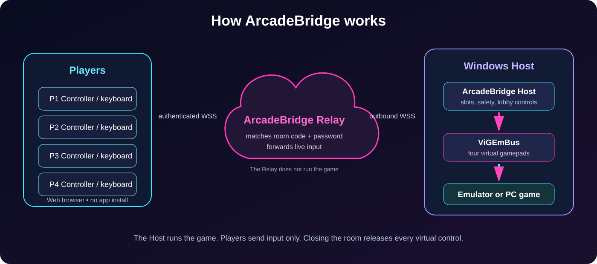
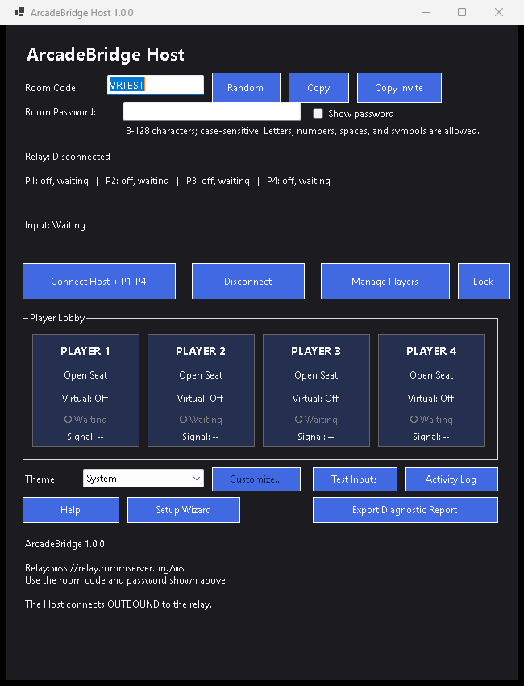
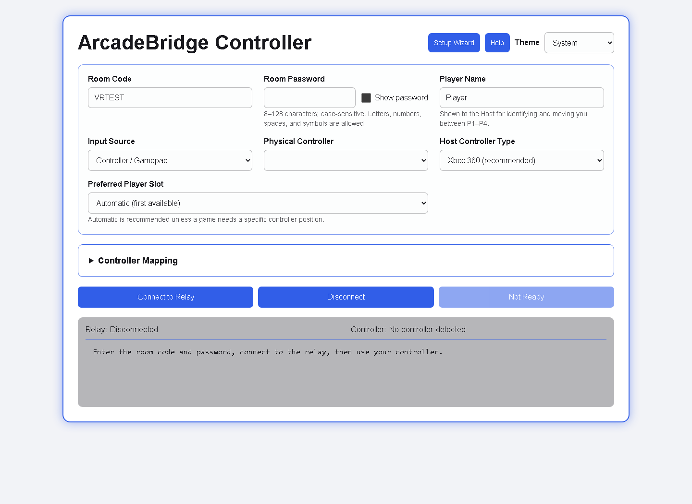
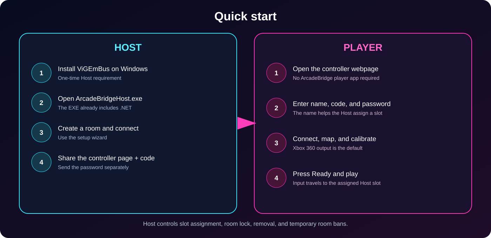

<p align="center">
  
</p>

<p align="center">
  <a href="https://github.com/K2daD/ArcadeBridge/releases/latest"></a>
  
  
  <a href="LICENSE"></a>
</p>

ArcadeBridge lets remote players use controllers or keyboards through a browser while a Windows Host receives up to four virtual Xbox 360 or DualShock 4 gamepads. It is designed for emulators, local-multiplayer PC games, and any situation where the game runs on one PC but the players are somewhere else.

> **Players install nothing.** They open the ArcadeBridge Controller webpage, enter their name and room credentials, map their controls, and connect. Only the Windows Host needs the Host application and ViGEmBus driver.

<p align="center">
  
</p>

## Contents

- [How it works](#how-it-works)
- [Features](#features)
- [Requirements](#requirements)
- [Quick start](#quick-start)
- [Host guide](#host-guide)
- [Player guide](#player-guide)
- [Mapping and calibration](#mapping-and-calibration)
- [Lobby controls](#lobby-controls)
- [Safety, privacy, and Relay behavior](#safety-privacy-and-relay-behavior)
- [Troubleshooting](#troubleshooting)
- [Building from source](#building-from-source)
- [License](#license)

## How it works

<p align="center">
  
</p>

1. The Host creates a room code and password, then connects **outbound** to the public Relay.
2. Each player opens the controller webpage and authenticates to the same room.
3. The webpage reads a supported browser gamepad or keyboard mapping and sends live input through an encrypted WebSocket connection.
4. The Relay matches the player to the Host room and forwards input; it does not run or stream the game.
5. The Host converts each player's input into one of four virtual gamepads through ViGEmBus.
6. The emulator or PC game sees ordinary local controllers.

ArcadeBridge carries **controller input**, not video or audio. Use your preferred game-streaming, screen-sharing, or remote-play solution if remote players also need to see and hear the game.

## Features

- Up to four independently assignable player slots (P1–P4).
- Browser gamepads and keyboard controls; Xbox, PlayStation, and many generic controllers can be mapped.
- Virtual Xbox 360 output by default for broad game compatibility.
- Optional virtual DualShock 4 output for games that accept it.
- Visual Xbox and PlayStation mapping layouts with press-to-map controls.
- Live button highlighting, duplicate-assignment warnings, and saved browser profiles.
- Stick deadzone and trigger sensitivity calibration.
- Player names, ready status, connection signal, and Host-controlled slot moving/swapping.
- Room lock, remove, temporary room ban, unban, and player-visible ban reasons.
- Setup wizards and built-in Help in both the Host and player webpage.
- Responsive System, Dark, Light, Retro Arcade, and Custom themes.
- Safe disconnect and stuck-input watchdog to release virtual controls.
- Host activity log, input tester, and password-safe diagnostic report.
- Self-contained Windows Host EXE; the Host does not need to install .NET.

## Screenshots

| Windows Host | Browser player |
|---|---|
|  |  |

## Requirements

### Host

- 64-bit Windows 10 or Windows 11.
- [ViGEmBus](https://github.com/nefarius/ViGEmBus/releases) installed on the Host PC.
- Internet access to the configured secure Relay.
- A game or emulator configured to use the created virtual controller slots.

### Players

- The ArcadeBridge Controller webpage.
- A current browser with the Gamepad API for physical controllers, or a keyboard.
- Internet access to the same Relay.

Browser gamepad support differs by browser, operating system, and controller. If one browser does not expose a physical controller, try another current browser or use the keyboard mapper. Advanced controller-specific features may not be exposed consistently by every browser.

## Download

Use the [latest GitHub Release](https://github.com/K2daD/ArcadeBridge/releases/latest). The recommended download is the complete `ArcadeBridge-Master-1.0.0-Final.zip`. The standalone Host EXE is also available for users who already have the player page and documentation.

Version 1.0.0 is currently **unsigned**, so Windows may show **Unknown publisher** or a Microsoft Defender SmartScreen warning. Verify the checksum before running it:

```text
ArcadeBridgeHost-1.0.0.exe
SHA-256: 8F99DCFCF7737887455AF676C3487942685FF18B1F8E0D378B6D07DF31833148
```

## Quick start

<p align="center">
  
</p>

### Host

1. Install ViGEmBus once on the Windows Host PC.
2. Download and extract the latest ArcadeBridge release.
3. Open `ArcadeBridgeHost.exe` and follow the setup wizard.
4. Keep the generated room code or enter your own valid code, then choose an 8–128 character case-sensitive password.
5. Select **Connect Host + P1–P4**.
6. Share the controller webpage and room code with players. Send the password through a trusted private channel.

### Player

1. Open the ArcadeBridge Controller webpage.
2. Follow the player setup wizard.
3. Enter a display name, the Host's room code, and room password.
4. Connect a controller or choose keyboard input.
5. Confirm the live input display, map or calibrate if needed, and select **Ready**.

The Host may move the player between slots without requiring the player to reconnect.

## Host guide

The Host application is the control center for the room.

- **Room Code** identifies the active room. The copy button copies only the safe invitation information; the password is excluded.
- **Room Password** authenticates both the Host and players. Use **Show password** only when nobody else can see the screen.
- **Connect Host + P1–P4** joins the Relay and creates four virtual controllers.
- **Disconnect** closes the room, releases every virtual control, and clears active room state.
- **Lock room** prevents new players from joining while existing players remain connected.
- **Player cards** show names, assigned slots, ready state, signal, and recent input.
- **Move/Swap** lets the Host place a player into any available slot.
- **Remove** disconnects a player. The player can reconnect if the room remains open and unlocked.
- **Ban** blocks that browser identity for the lifetime of the current room and may include a reason. **Unban** allows the player to return.
- **Input tester** shows whether the Host is receiving controls without launching a game.
- **Diagnostics** creates a support report that excludes the room password.
- **Help** explains every control. The setup wizard can be opened again from the Host.

For a focused walkthrough, see [Host Guide](docs/HOST-GUIDE.md).

## Player guide

The player webpage is both the connection screen and controller setup tool.

- Enter a short recognizable player name so the Host can assign the correct slot.
- Select a physical gamepad or keyboard as the input source.
- Click a virtual control on the diagram, then press the physical button or key to assign it.
- Duplicate mappings receive a red warning so accidental conflicts can be corrected.
- Pressed controls light up on the layout before and during connection.
- Profiles and calibration are stored in that browser on that device.
- **Ready** tells the Host the player is prepared; it does not start the game.
- **Disconnect** releases all sent controls immediately.

See [Player Guide](docs/PLAYER-GUIDE.md) for the full walkthrough.

## Mapping and calibration

ArcadeBridge maps a physical input to the virtual controller selected by the player. The game still receives a normal Xbox 360 or DualShock 4 controller from the Host.

1. Choose the desired virtual output layout.
2. Click the virtual button, direction, trigger, or stick axis on the controller picture.
3. Press the physical button/key or move the physical axis you want to assign.
4. Resolve any red duplicate warnings.
5. Test the live highlights.
6. Save the profile with a useful name.

Use calibration when a stick drifts, does not reach full range, or a trigger activates too early. Increase the inner deadzone only enough to remove drift. Avoid an excessive deadzone because it reduces fine movement. Calibration stays on the player's device and does not change the Host PC.

## Lobby controls

| Control | What it does |
|---|---|
| Ready | Shows the Host that the player is prepared. |
| Move/Swap | Changes the virtual P1–P4 slot used by that player. |
| Lock room | Stops new joins without disconnecting current players. |
| Remove | Disconnects one player; reconnecting is still allowed. |
| Ban | Blocks that browser identity until the Host room closes or the Host unbans it. |
| Ban reason | Shows the player why the Host blocked the connection. |
| Input tester | Confirms Host-side input without opening a game. |

## Safety, privacy, and Relay behavior

- Host and player connections use `wss://relay.rommserver.org/ws` in version 1.0.0.
- The Host connects outbound, so ordinary Hosts do not expose a listening game-controller port.
- Room passwords are used for authentication and are excluded from copied invitation links and Host diagnostic reports.
- Player mappings and calibration remain in the player's browser storage.
- Active rooms, slot state, and room bans are held in Relay memory and clear when the room closes or the Relay restarts.
- The disconnect path and watchdog release buttons, triggers, and sticks if input stops arriving.
- The Relay administrator must maintain HTTPS/WSS, DNS, certificates, Docker, and server availability.

Do not treat a room password as permanent account security. Use a unique password for each play session and share it privately.

## Troubleshooting

### The Host cannot create virtual controllers

Install or repair ViGEmBus, restart Windows, then reopen ArcadeBridge Host. Also close old Host instances or controller tools that may have left virtual devices active.

### The player cannot join

Check the room code and case-sensitive password. Confirm the Host shows **Relay: Connected**, the room is unlocked, and the public Relay status page is available.

### The webpage does not detect a controller

Press a controller button after the page loads, reconnect the controller, then refresh. Try another current browser if the operating system/browser combination does not expose that controller. Keyboard mapping remains available.

### The Host is connected but the game sees no input

Use the Host input tester first. If it reacts, select the corresponding virtual controller in the game or emulator and restart the game after ArcadeBridge has created the virtual devices.

### Buttons become stuck after a connection problem

Select **Disconnect** on the player and Host, then reconnect. ArcadeBridge also has a watchdog that releases input after updates stop.

More fixes are in [Troubleshooting](docs/TROUBLESHOOTING.md).

## Repository layout

```text
src/Host/          Windows Host application
src/Player-Web/    Browser controller webpage
src/Relay/         ASP.NET Core WebSocket Relay and Docker files
docs/              Host, player, Relay, setup, and troubleshooting guides
docs/assets/       README artwork, diagrams, screenshots, and demo GIF
```

Release binaries are intentionally kept out of the source tree. Attach `ArcadeBridge-Master-1.0.0-Final.zip`, `ArcadeBridgeHost-1.0.0.exe`, and the checksum file to a GitHub Release.

## Building from source

### Host

Install the .NET 10 SDK and run from `src/Host`:

```powershell
dotnet publish -c Release -r win-x64 --self-contained true -p:PublishSingleFile=true
```

### Player webpage

`src/Player-Web/index.html` is a static webpage. Publish it through an HTTPS web server. Browsers restrict some controller features on insecure pages.

### Relay

Only the Relay administrator needs this component. From `src/Relay`:

```powershell
docker compose up -d --build
```

Do not replace a production Relay without preserving its reverse proxy, DNS, TLS certificate, and port configuration.

## Release checklist

1. Build and test the Host, player webpage, and Relay together.
2. Confirm wrong room codes and passwords are rejected.
3. Test all four slots, moving/swapping, ready state, lock, remove, ban, and unban.
4. Test keyboard and at least one physical controller mapping.
5. Generate the SHA-256 checksum for every executable download.
6. Confirm no password, certificate, private key, diagnostic report, or local backup is included.
7. Tag the release (for example, `v1.0.0`) and attach binaries to GitHub Releases.

## License

ArcadeBridge source and original documentation are available under the [MIT License](LICENSE). MIT was selected to keep the project simple and permissive: reuse, modification, redistribution, and commercial use are allowed when the copyright and license notice are preserved. The software is provided without warranty.

Third-party components keep their own licenses; see [Third-party notices](THIRD-PARTY-NOTICES.md).

ArcadeBridge is not affiliated with Microsoft, Xbox, Sony, PlayStation, Dolphin Emulator, or shadPS4. Names are used only to describe compatibility.
